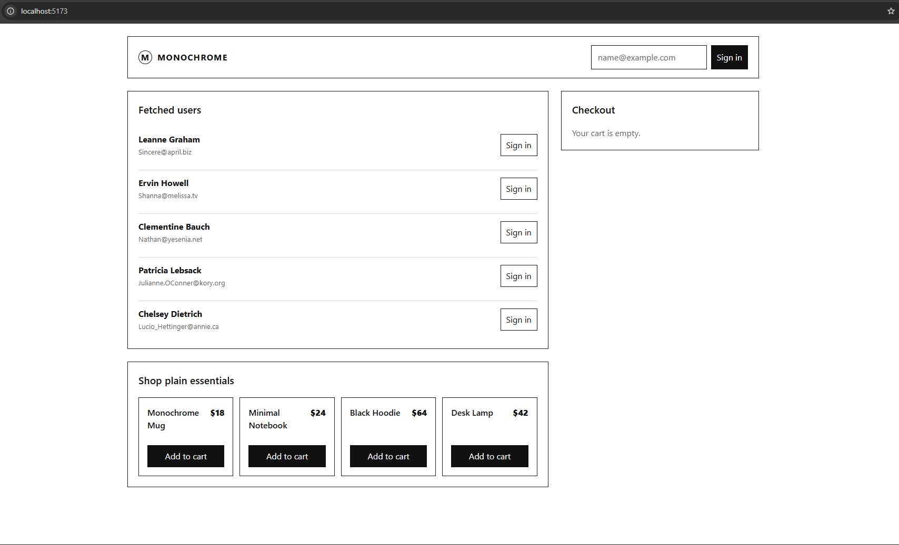
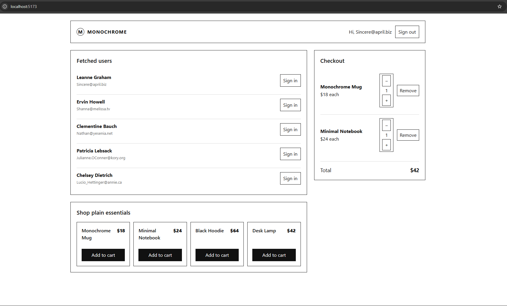

# Context & Reducer Practice

A React + TypeScript practice project focused on **Generics, Context API, `useReducer`, and Discriminated Unions**.

## What I Built

- **Generic `useFetch<T>`** — reusable typed async data-fetching hook.
- **`AuthContext`** — manages sign-in/sign-out without prop drilling.
- **`CartContext` + `useReducer`** — centralizes cart actions and rules.
- **Discriminated Union `Action`** — type-safe cart actions.
- **Checkout Summary** — reads cart data directly from `CartContext`.

## Key Concepts

- TypeScript Generics
- React Context API
- `useReducer`
- Discriminated Unions
- Pure reducer functions
- Avoiding prop drilling

## Requirements Verified

- `useFetch<User[]>` correctly types `data`.
- `data` requires a null check before using `.map()`.
- Auth consumers are rendered inside `AuthProvider`.
- Cart consumers are rendered inside `CartProvider`.
- The reducer contains no side effects.
- Unknown reducer actions return the existing state unchanged.
- Cart quantity `0` removes the item.

## 6. Evidence

Screenshots/recording demonstrate:

### Signout

### Signin

. The discriminated-union action type only allows valid action shapes and quantities, so an item with a quantity of -1 cannot be represented as a valid action
