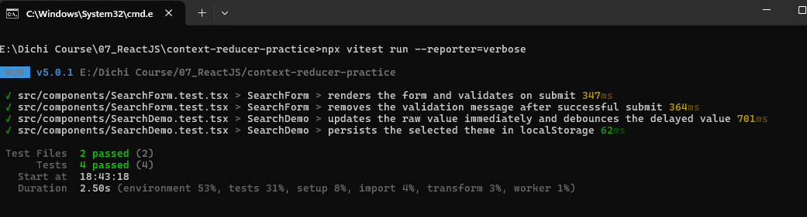

# Testing Report

## Overview

This update adds a real UI testing setup for the React app using Vitest, React Testing Library, and Jest DOM matchers. The goal is to validate user-facing behavior instead of implementation details, with tests written around labels, roles, visible text, and form interactions.

## What was added

- Vitest configuration in [vite.config.ts](vite.config.ts)
- TypeScript matcher support in [tsconfig.app.json](tsconfig.app.json)
- Jest DOM setup file in [src/test/setup.ts](src/test/setup.ts)
- Test coverage for form validation and async UI behavior in:
  - [src/components/SearchForm.test.tsx](src/components/SearchForm.test.tsx)
  - [src/components/SearchDemo.test.tsx](src/components/SearchDemo.test.tsx)

## Testing setup

The project now includes:

- `vitest`
- `@testing-library/react`
- `@testing-library/user-event`
- `jsdom`
- `@testing-library/jest-dom`

This enables browser-like testing for component rendering, user typing, submit events, validation messages, async text waits, and localStorage persistence.

## Test cases covered

### 1. Search form validation

- Renders the input using `getByLabelText("Search")`
- Verifies the button renders with `getByRole`
- Submits empty input and checks the validation error appears
- Confirms `onSubmit` is not called when the input is empty
- Types a valid value and confirms submit passes the trimmed value

### 2. Error removal after successful submit

- Fills the field with whitespace to trigger invalid state
- Checks the validation message is shown
- Clears the input and enters a valid value
- Verifies the error element is removed using `queryByRole("alert")`

### 3. Debounced search demo

- Types into the search field
- Confirms the raw value updates immediately
- Waits with `findBy` for the debounced value to appear after the delay

### 4. Theme persistence

- Confirms the initial theme value is stored in `localStorage`
- Clicks the toggle button
- Verifies the new value is persisted using `localStorage.getItem("theme")`

## Notes

The tests follow the user-behavior pattern recommended for React UI testing:

- queries use labels and visible text, not test IDs
- assertions check DOM behavior, not implementation details
- async behavior is verified with `findBy*` where appropriate
- conditional UI disappearance is checked with `queryBy*`

## Verification status

The project is configured for test execution with:

```bash
npx vitest run --reporter=verbose
```

This command is ready to run in the project root. The matcher setup was fixed by adding the Jest DOM package and registering it in TypeScript so matchers like `toBeInTheDocument` and `toHaveTextContent` are recognized.

## Evidence

Screenshots/recording demonstrate:

### Testing result



. Without debounce cleanup, old timers could still update the debounced value after newer input.
